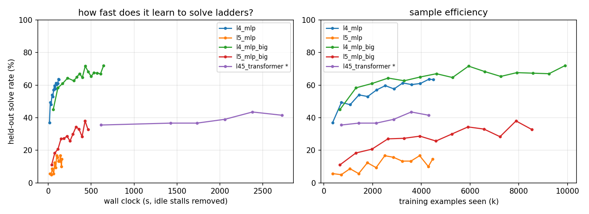

# weaver-nn

I got curious one weekend about how fast a little neural net could learn to play
[Weaver](https://wordwormdormdork.com/), the word-ladder game. You start on one
word and change a single letter at a time until you reach a target word, and
every word along the way has to be a real one. EAST → VAST → VEST → WEST, that
kind of thing. Fewest steps wins.

To be clear, a neural net is a ridiculous tool for this. Plain old BFS (breadth-
first search, the patient, boring algorithm that checks everything one step
away, then everything two steps away, and so on) already finds the perfect
answer faster than you can blink. But "can a computer do this" was never the
question. I wanted to know how fast a net could *figure the game out on its own*,
just from watching examples. Short version: stupidly fast for 4-letter words,
and for 5-letter words it face-plants in a way that turned out to be the most
interesting part of the whole project.

> **Update (June 2026):** came back to this and did a cleanup pass. Tidied up
> the code, sped up a couple of the slower bits, and gave the README a polish.
> Same results, just nicer to be around.

## How it works

Five little scripts, run in order. Nothing clever going on.

**The word list** (`build_words.py`). I take dwyl's giant English dictionary
(this decides what counts as a real word) and cross it with Norvig's list of how
often words show up on the web (this decides which words are common enough to
bother with), then keep the top 3,500 four-letter and 6,000 five-letter words.
Use the whole dictionary and the thing fills up with garbage nobody's heard of
like "yald"; keep only the top 1,000 and there aren't enough words to make decent
ladders. A few thousand felt about right. One thing that mattered way more than I
expected: the 4-letter words form a nice dense web (each one connects to ~10
others), while the 5-letter words are spread way out (~4 each). File that away,
it comes back to bite us.

**Training data** (`gen_data.py`). Here's the nice shortcut. Run one BFS starting
*from the target word* and you instantly get the true distance from every other
word back to it. That means every word turns into a free labeled example, and the
best moves from any spot are simply the neighbors sitting one step closer to the
goal. No path sampling, and you get *all* the equally-good moves for a position
instead of one arbitrary "correct" answer (most spots have a few ties, and
pretending one is special would just teach the net nonsense). I keep the target
words used for testing completely separate from the ones used for training, so
the net always gets quizzed on goals it's never practiced.

**The models** (`model.py`). Both get fed (where I am, where I'm trying to get)
and have to score every possible "change this letter to that one" move.

- `PolicyMLP`: the simple one. One-hot the two words, two hidden layers, done.
  Locked to a single word length. The baseline.
- `PolicyTransformer`: the fancier one that reads a word letter by letter, which
  is the trick that lets a single model handle *any* word length at all.

**Training** (`train.py`). I train it to match all of the best moves at once
rather than picking a favorite, since most positions have a few equally short
options and rewarding just one of them would only add noise.

**Playing** (`evaluate.py`, `play.py`). The net never actually blurts out a fake
word. Like a chess engine that only looks at legal moves, it only ever scores
real ones (real word, one letter changed, somewhere it hasn't already been).
Two ways it plays:

- **Greedy**: just grab the single best-looking move every time. Dead simple,
  but one wrong turn and it's toast.
- **Beam search**: keep your 8 most promising half-finished ladders alive at
  once instead of betting everything on a single guess. A little bit of "look
  before you leap" that rescues a *ton* of the harder puzzles.

## Results

Everything ran on a normal laptop CPU. No GPU, no cloud, just my poor processor
grinding away. I test on 500 held-out puzzles whose target words the net never
trained on, and "optimal" means the net's ladder is exactly as short as the
perfect BFS answer.

| model | params | train data | train time | greedy solve | beam-8 solve | beam-8 optimal |
|---|---|---|---|---|---|---|
| 4-letter MLP v1 | 0.4M | 180k states | 124 s | 64% | 87% | 71% |
| 4-letter MLP v2 | 1.4M | 330k states | 645 s | 70% | **93%** | **83%** |
| 5-letter MLP v1 | 0.5M | 180k states | 158 s | 16% | 55% | 27% |
| 5-letter MLP v2 | 1.5M | 330k states | ~430 s | 35% | **75%** | **45%** |
| transformer @ 4 letters | 0.6M | 360k states¹ | ~45 min¹ | 63% | 92% | 73% |
| transformer @ 5 letters | 0.6M | 360k states¹ | ~45 min¹ | 24% | 55% | 34% |

¹ Same model for both rows: one length-agnostic transformer trained on both
lengths at once (180k 4-letter + 180k 5-letter states), then tested on each
separately. The training time is approximate because that run got mugged by a
laptop power-throttle stall halfway through (story's at the bottom), so the plot
quietly rebuilds its timeline with the one dead gap taken out.



Left plot is solve rate against wall-clock time (idle stalls stripped out; a `*`
marks a run that had one removed). Right plot is solve rate against how many
examples it's seen, which doesn't care how fast your computer is, so it's the
fairer comparison.

A few things jumped out:

**4 letters is easy.** The basic model is already solving half its puzzles after
about 42 seconds of training (yes, seconds), and reaches 87% solved with a little
beam search after roughly two minutes. Feed it more data and it hits 93%, and on
the short ladders a human would actually be served in the game, it's basically
perfect.

**5 letters is the same game on hard mode.** The net learns the individual moves
just as fast (~83% of the time it picks a good next move). The problem is the
sparser 5-letter web makes puzzles run 8–10 steps long, and greedy has to nail
*every single one* in a row. The math on that is grim: roughly 0.83 to the 9th
power ≈ 19%, which is about what greedy actually scores. Not great, Bob. Beam
search drags it back up to 75%.

**Learning the moves was quick; learning the routes was the slog.** Doubling the
training data barely moved how often it picks a good next move (+5 points) but
nearly *doubled* how often it finds the genuinely shortest path. The net was
never confused about letters. It just hadn't built a good mental map of the
whole word-maze yet.

**One model for any length, basically for free.** Because the transformer reads
words letter by letter, the exact same trained weights handle both 4- and
5-letter puzzles. Trained on both at once, and only on the smaller pile of data,
it roughly ties the specialized single-length models trained on that same data:
92% vs 87% on 4 letters, 55% vs 55% on 5. I'd bet feeding it more data would push
it past them too, I just haven't gotten around to it.

And my favorite bit: after training, if you rip out the "legal moves only"
guardrail entirely and just let the net pick whatever it wants, its top choice is
*already* a real dictionary word 99% of the time. Nobody told it to do that. It
accidentally memorized English as a side effect of learning to copy BFS. lol.

Here's what a solve looks like:

```
$ python play.py east west --ckpt runs/l4_mlp_big/best.pt
bfs    (3 steps): east -> bast -> best -> west
greedy (4 steps, +1 extra): east -> gast -> gest -> mest -> west
beam8  (3 steps, optimal!): east -> mast -> mest -> west
```

## Run it

```
pip install -r requirements.txt
python build_words.py

# small (v1) datasets, also used by the length-agnostic transformer
python gen_data.py --words words/words4.txt --out data/l4 --seed 0
python gen_data.py --words words/words5.txt --out data/l5 --seed 1
# bigger (v2) datasets: more target words means better routes
python gen_data.py --words words/words4.txt --out data/l4_big --targets 1500 --per-target 220 --seed 10
python gen_data.py --words words/words5.txt --out data/l5_big --targets 1500 --per-target 220 --seed 11

# the v2 single-length MLPs and the one-model-fits-both transformer
python train.py --data data/l4_big --arch mlp --hidden 1024 --epochs 30 --out runs/l4_mlp_big
python train.py --data data/l5_big --arch mlp --hidden 1024 --epochs 30 --out runs/l5_mlp_big
python train.py --data data/l4 data/l5 --arch transformer --epochs 12 --bs 512 --lr 5e-4 --out runs/l45_transformer

python evaluate.py --ckpt runs/l4_mlp_big/best.pt        # solve rates + sample ladders
python plot_curves.py                                    # results/learning_curves.png
python play.py east west --ckpt runs/l4_mlp_big/best.pt  # solve one ladder
python play.py crane plumb --ckpt runs/l45_transformer/best.pt   # transformer, any length
```

On this laptop CPU the 4-letter MLP trains in about 2 minutes, the v2 models in
7–11 minutes each, and the transformer in about 45.

## Honest caveats

Real talk, the numbers up there are flattering in a couple of ways:

- The "legal moves only" guardrail does some heavy lifting. But the *route* is
  still the net's call, and like that 99% thing shows, it'd mostly stay on the
  rails even without the guardrail holding its hand.
- My word lists are ranked by how common words are online, which means a little
  junk sneaks in ("mest"? "xref"? sure, internet, whatever you say). That makes
  the puzzles a touch easier than a proper game dictionary would. Fine for a fun
  experiment, not something I'd ship.
- The test targets are unseen, but the vocabulary is only a few thousand words,
  so every individual word has shown up *somewhere* during training. A stricter
  test would wall off whole chunks of the word-maze.
- Greedy plateaus hard, and honestly that's the moral of the story: getting each
  move ~80% right is easy, but a perfect ladder needs you to be right on every
  step at once (0.8^9 is 13%). A pinch of search beats a smarter-looking model
  that's too sure of itself. There's probably a life lesson in there.
- The transformer's no-guardrail pick is legal "only" 89% (4-letter) / 95%
  (5-letter) of the time versus the simpler models' 99%. Makes sense, it's
  juggling two word lengths with the same handful of brain cells.

And a war story, because it ate an entire evening of my life: one training run
just... stopped. For 108 minutes. In the middle of a single epoch. Turns out my
laptop had quietly throttled itself down to a crawl the moment I walked away and
the screen went to sleep. No error, no crash, just vibing at ~5% speed and then
snapping back to full power the instant I wiggled the mouse. I only caught it
because one epoch in the log took 18x longer than all the others. If you ever run
long jobs on a laptop, save yourself the headache: `powercfg /change
standby-timeout-ac 0`, `powercfg /change monitor-timeout-ac 0`, and switch to the
High Performance plan before you start. Learn from my pain.

## Maybe later

- One transformer trained across lengths 3–7, with a properly hand-picked word
  list this time (no more "xref").
- A version that guesses *how far it is from the goal* instead of which move to
  make, basically a learned gut feeling you could bolt onto a smarter search.
- A bit of reinforcement learning so the net can learn to dig itself out of its
  own mistakes, instead of only ever copying BFS's perfect play.
